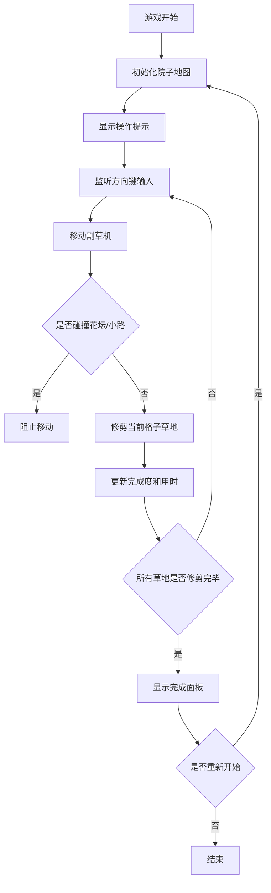

## 1. 产品概述

一款俯视视角的割草解压小游戏，玩家操控割草机在院子中修剪草地，通过整齐的修剪纹路和完成度评分带来极度舒适的解压体验。

- 核心目标：通过简单的方向键控制，完成整片草地的修剪，享受整齐划一的视觉满足感
- 目标用户：喜欢解压小游戏、休闲娱乐的所有年龄段用户

## 2. 核心功能

### 2.1 功能模块

1. **游戏主界面**：游戏画布、操作提示区域、状态信息（用时、完成度）
2. **游戏画布**：俯视视角的院子地图，包含草地、花坛、小路等元素
3. **操作提示**：方向键控制说明、游戏规则简介
4. **完成面板**：修剪完成后显示用时、完成度、整齐度评分，支持重新开始

### 2.2 页面详情

| 页面名称 | 模块名称 | 功能描述 |
|-----------|-------------|---------------------|
| 游戏主界面 | 游戏画布 | 俯视视角渲染院子地图，实时显示割草机位置和修剪进度 |
| 游戏主界面 | 状态信息 | 显示当前游戏用时、已修剪面积百分比 |
| 游戏主界面 | 操作提示 | 显示方向键控制说明，提醒避开花坛和小路 |
| 完成面板 | 评分展示 | 展示最终用时、完成度、整齐度综合评分 |
| 完成面板 | 重新开始 | 重置游戏状态，开始新一局 |

## 3. 核心流程

游戏开始 → 玩家使用方向键控制割草机移动 → 割草机经过的草地被修剪并留下纹路 → 实时更新完成度和用时 → 全部可修剪区域完成 → 弹出完成面板显示评分 → 可选择重新开始

## 4. 用户界面设计

### 4.1 设计风格

- **主色调**：清新自然的草绿色系（#4CAF50 深绿、#81C784 中绿、#A5D6A7 浅绿）
- **辅助色**：泥土棕（#795548）用于小路，花色点缀用于花坛
- **按钮风格**：圆角矩形，柔和阴影，悬停有轻微放大动效
- **字体**：圆润友好的无衬线字体，大号清晰易读
- **布局风格**：居中布局，游戏画布为视觉焦点，操作提示和状态信息环绕四周
- **整体氛围**：宁静、舒适、自然，仿佛置身于阳光明媚的午后花园

### 4.2 页面设计概览

| 页面名称 | 模块名称 | UI 元素 |
|-----------|-------------|-------------|
| 游戏主界面 | 游戏画布 | 网格状草地，深浅交替修剪纹路，割草机图标，花坛/小路障碍物 |
| 游戏主界面 | 状态信息 | 顶部显示计时器、完成度百分比，简洁数字展示 |
| 游戏主界面 | 操作提示 | 底部或侧边显示方向键图标和控制说明 |
| 完成面板 | 评分展示 | 居中弹出卡片，三栏展示用时、完成度、整齐度评分 |
| 完成面板 | 重新开始 | 底部绿色按钮，带叶子图标 |

### 4.3 响应式

- 桌面端优先设计，游戏画布固定宽高比
- 移动端适配触屏滑动控制，缩小操作提示文字
- 小屏幕下完成面板自适应宽度
