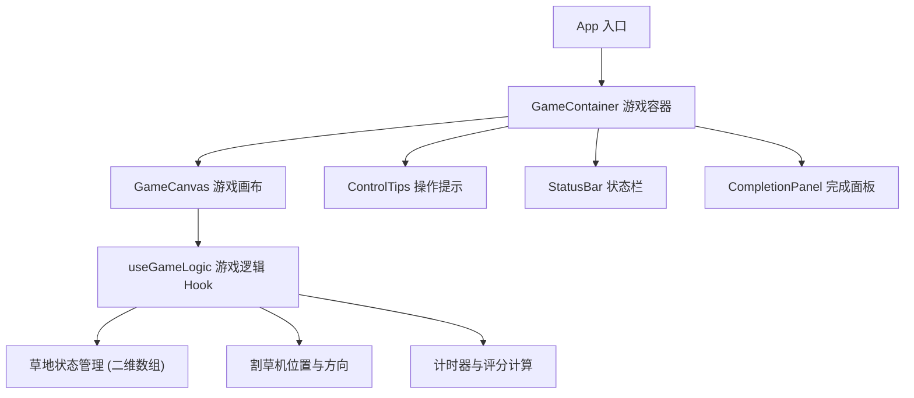

## 1. 架构设计



## 2. 技术描述

- **前端框架**：React@18 + TypeScript + Vite
- **样式方案**：Tailwind CSS@3
- **渲染方式**：HTML5 Canvas 2D 渲染游戏画面
- **状态管理**：React Hooks (useState, useEffect, useCallback, useRef)
- **纯前端应用**，无需后端服务

## 3. 组件结构

| 组件路径 | 组件名 | 职责 |
|----------|--------|------|
| /src/App.tsx | App | 根组件，整体布局 |
| /src/components/GameContainer.tsx | GameContainer | 游戏主容器，管理游戏生命周期 |
| /src/components/GameCanvas.tsx | GameCanvas | Canvas 画布组件，渲染游戏画面 |
| /src/components/ControlTips.tsx | ControlTips | 操作提示组件，显示控制说明 |
| /src/components/StatusBar.tsx | StatusBar | 状态栏组件，显示用时和完成度 |
| /src/components/CompletionPanel.tsx | CompletionPanel | 完成面板组件，展示评分和重新开始 |
| /src/hooks/useGameLogic.ts | useGameLogic | 游戏核心逻辑 Hook |
| /src/utils/gameUtils.ts | gameUtils | 游戏工具函数（地图生成、评分计算等） |
| /src/types/game.ts | game types | 游戏类型定义 |

## 4. 数据模型

### 4.1 核心类型定义

```typescript
// 格子类型
type CellType = 'grass' | 'flower' | 'path' | 'mowed';

// 单个格子
interface Cell {
  type: CellType;
  grassHeight: number;  // 0-3 表示草的高度，0 表示已修剪
  mowedRow: number | null;  // 记录修剪时的行号，用于奇偶行纹路
}

// 割草机状态
interface Mower {
  x: number;
  y: number;
  direction: 'up' | 'down' | 'left' | 'right';
}

// 游戏状态
interface GameState {
  grid: Cell[][];
  mower: Mower;
  startTime: number;
  elapsedTime: number;
  completed: boolean;
  totalGrassCells: number;
  mowedCells: number;
}

// 评分结果
interface ScoreResult {
  time: number;         // 用时（秒）
  completion: number;   // 完成度（百分比）
  neatness: number;     // 整齐度（百分比）
  total: number;        // 综合评分
}
```

### 4.2 游戏逻辑说明

1. **地图生成**：使用二维数组存储院子地图，随机生成花坛和小路作为障碍物，其余为草地
2. **移动控制**：监听键盘方向键，割草机每次移动一格，遇到障碍物则不移动
3. **修剪逻辑**：割草机经过的格子 grassHeight 降为 0，标记为已修剪，记录行号用于纹路渲染
4. **纹路效果**：通过奇偶行交替使用不同深浅的绿色模拟真实割草机滚压效果
5. **评分计算**：
   - 完成度 = 已修剪格子数 / 总草地格子数 × 100%
   - 整齐度 = 连续直线修剪的格子占比（基于路径分析）
   - 用时越短评分越高
6. **完成判定**：当所有草地格子都被修剪完毕时，触发完成面板
